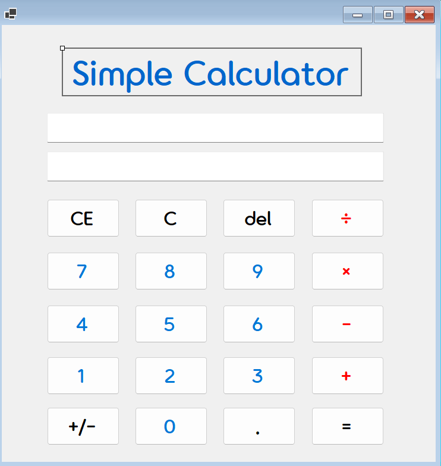
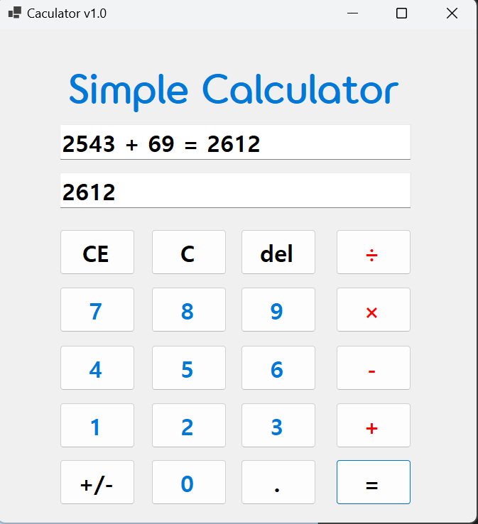
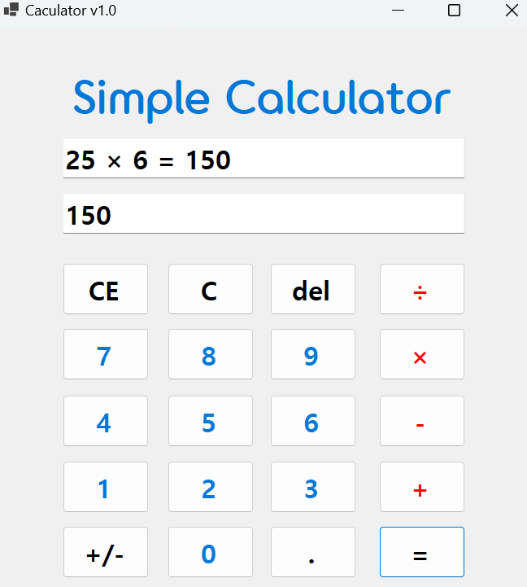
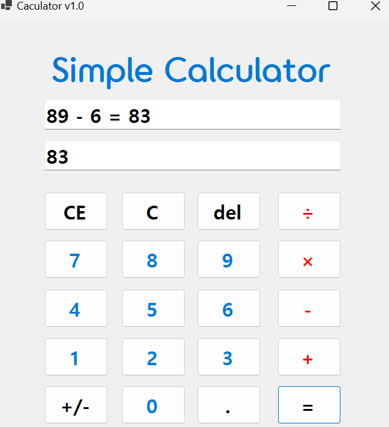
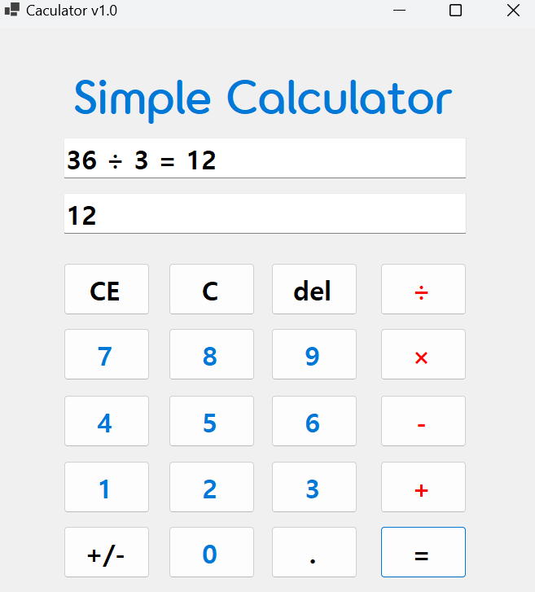
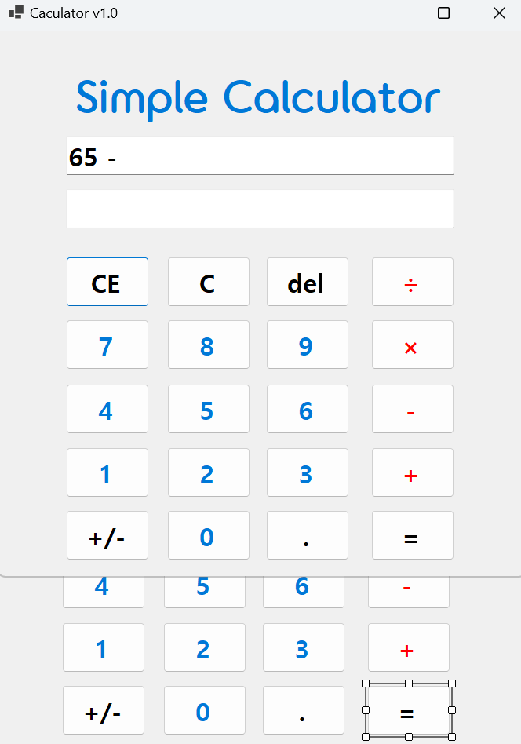
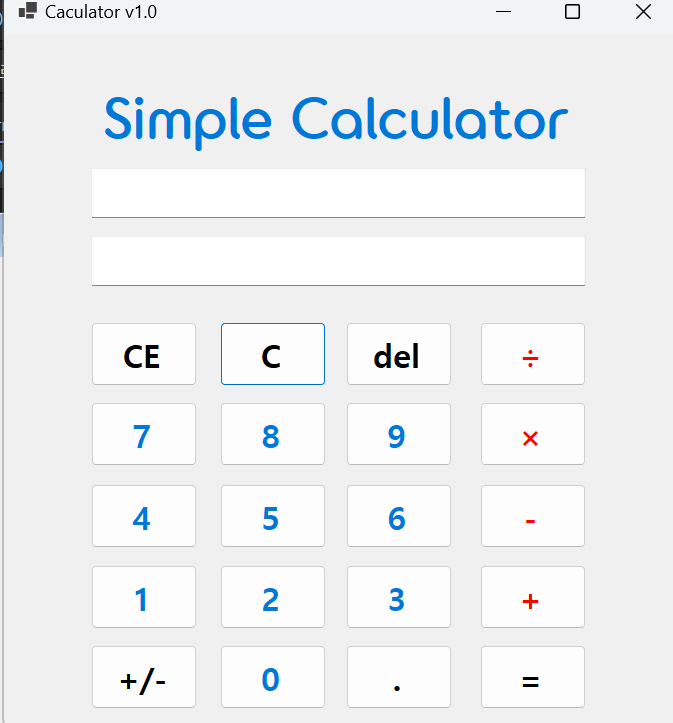
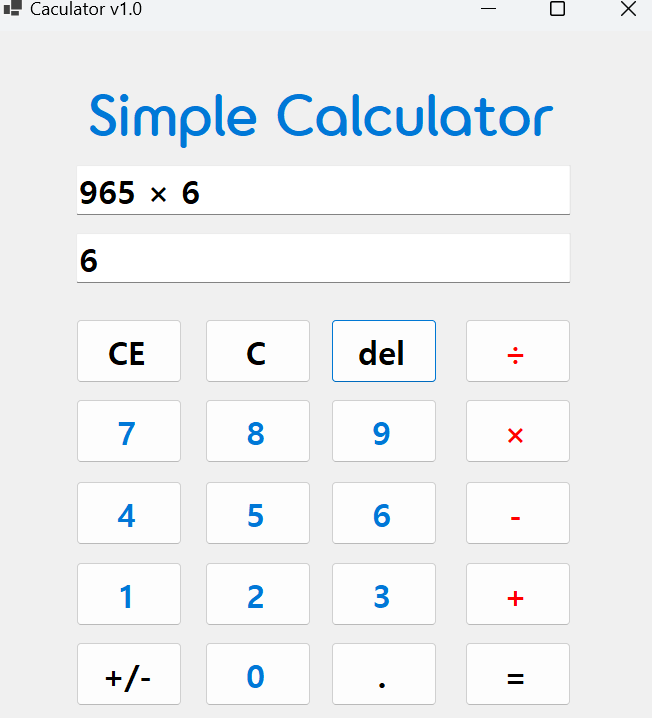

# (C# 코딩) <Simple Caculator>

## 개요
-C# 프로그래밍학습
-1줄소개: 버튼을 눌러 계산을 할 수 있는 계산기 프로그램입니다.
-사용한플랫폼: 
  -C#, .NET Windows Forms, Visual Studio, GitHub
-사용한컨트롤:
  -Label, Button, TextBox
-사용한기술과구현한기능:
 -덧셈 로직 표현
 -사칙연산의 완성
 -C, CE, del 버튼 기능 추가 구현

## 실행화면(과제1)
-과제1코드의실행스크린샷

-과제내용
 -컨트롤 배치와 기본적인 속성 설정
 -입력 내용을 2가지로 표현하는 기능 구현
 -계산기의 더하기 기능 구현

-구현내용과기능설명
 -UI 구성
 -숫자 입력 기능
 -사칙연산 계산 기능
 -계산 결과 출력

## 실행화면(과제2)
-과제2코드의실행스크린샷

-과제내용
 -빼기, 곱하기, 나누기 구현하기

-구현내용과기능설명
 -뺄셈(-), 곱셈(*), 나눗셈(/) 버튼 추가
 -이벤트 연결

## 실행화면(과제3)
-과제3코드의실행스크린샷

-과제내용
 -계산기에 있는 수정/삭제 기능 구현

-구현내용과기능설명
 1. 다음의 사례로 설명
▶ 12 + 100 = 112
2. C 버튼
▶ 현재의 모든 내용을 삭제하고 처음 (초기화된) 상태로 되돌아감
3. CE 버튼
▶ 마지막 입력한 피연산자(Operand) 값을 삭제함
▶ 100 입력 후에 Del 눌렀다면 100 값이 통째로 삭제됨
4. Del 버튼
▶ 마지막 입력된 글자 하나 (숫자 하나) 값을 삭제함
▶ 100 입력 후에 Del 눌렀다면 10 으로 변경됨
